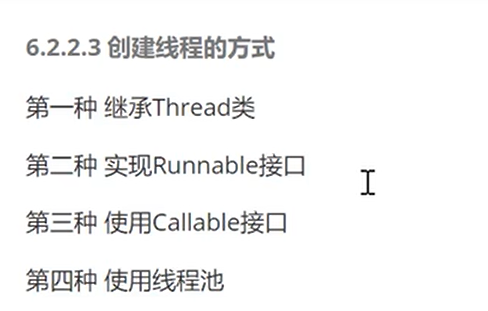
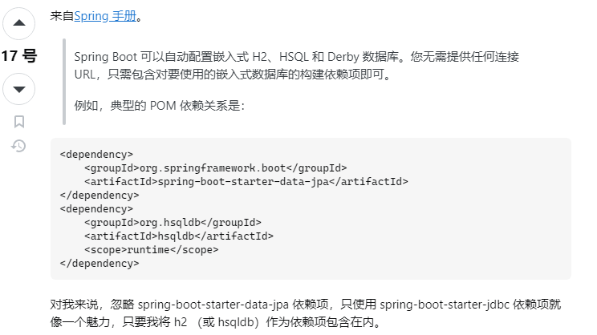

# 扫盲笔记
## lombok
作用：提高开发效率，通过注解形式使javabean生成get、set、有参数、无参数、toString等方法，无需手动实现。
## Mybatis
数据库管理简化开发工具。sql和java编码分开，功能边界清晰，一个专注业务，一个专注数据
### 使用
#### 1搭建数据库

#### 2新建项目——添加依赖

#### 3配置Mybatis——xml文件

#### 4编写Mybatis工具类

#### 5实体类

#### 6Dao接口
就是Mapper.java,添加扫描到mapper
## Nginx
### 反向代理服务器：转发请求到不同的微服务模块端口。

http{
改配置
端口号
路径
}

开始 nginx.exe

结束 nginx.exe -s -stop

### 负载均衡：

## SpringBoot

### 代码生成器
1依赖

**2工具类**
改：绝对路径+数据库+包名+表名
### 手动抛出异常
threw new 异常类。

### 注解
@Repository是Spring框架中的注解，用于标注数据访问层（DAO）的类。它的作用是将数据访问层的类标识为Spring容器中的Bean对象，从而可以在其他地方方便地使用。
## 报错
### If you want an embedded database (H2, HSQL or Derby), please put it on the classpath. 

### If you have database settings to be loaded from a particular profile you may need to activate it (no profiles are currently active).
将yml文件换成application.properties文件才能激活。
### mybatis plus报Invalid bound statement (not found)
参考 https://blog.csdn.net/wwrzyy/article/details/86034458 保留一个配置就可以了，这俩配置冲突。

### MySQL JDBC Error: Public Key Retrieval is not allowed
参考 https://www.codejava.net/java-se/jdbc/fix-error-public-key-retrieval-is-not-allowed 

jdbc:mysql://localhost:3306/xxx?allowPublicKeyRetrieval=true&useSSL=false

