# 扫盲笔记

## lombok

作用：提高开发效率，通过注解形式使javabean生成get、set、有参数、无参数、toString等方法，无需手动实现。

## Mybatis

数据库管理简化开发工具。sql和java编码分开，功能边界清晰，一个专注业务，一个专注数据

### 使用

#### 1搭建数据库

#### 2新建项目——添加依赖

#### 3配置Mybatis——xml文件

#### 4编写Mybatis工具类

#### 5实体类

#### 6Dao接口

就是Mapper.java,添加扫描到mapper

## Nginx

### 反向代理服务器：转发请求到不同的微服务模块端口。

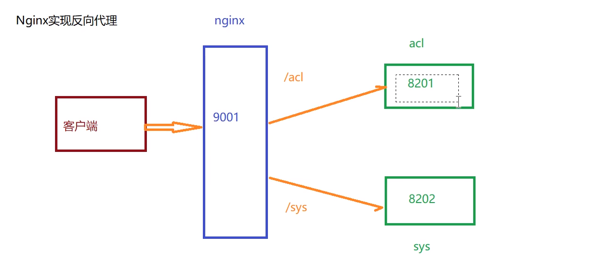
http{
改配置
端口号
路径
}

开始 nginx.exe

结束 nginx.exe -s -stop

### 负载均衡：

## 阿里云OSS

在上传图片的模块中，通过阿里云OSS对图片文件存储。
阿里云对象存储 OSS（Object Storage Service）是一款海量、安全、低成本、高可靠的云存储服务，提供最高可达 99.995 % 的服务可用性。多种存储类型供选择，全面优化存储成本。
记得先写pom.xml依赖文件。

## SpringBoot

### 代码生成器

1依赖

**2工具类**
改：绝对路径+数据库+包名+表名

### 手动抛出异常

threw new 异常类。

## Spring

MultipartFile//一种类型得到上传的文件
@Value{}//从配置文件中取值

## Spring Cloud

Spring Cloud是一系列框架的集合。
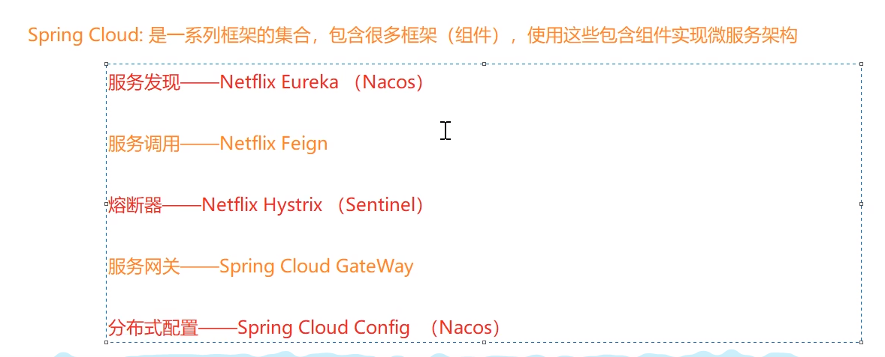
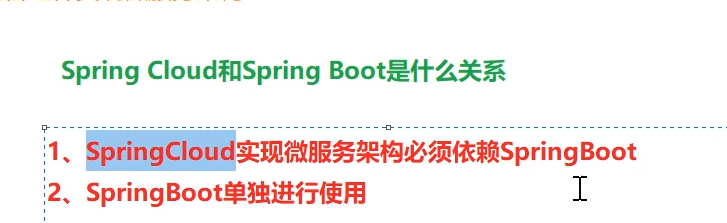

### Nacos

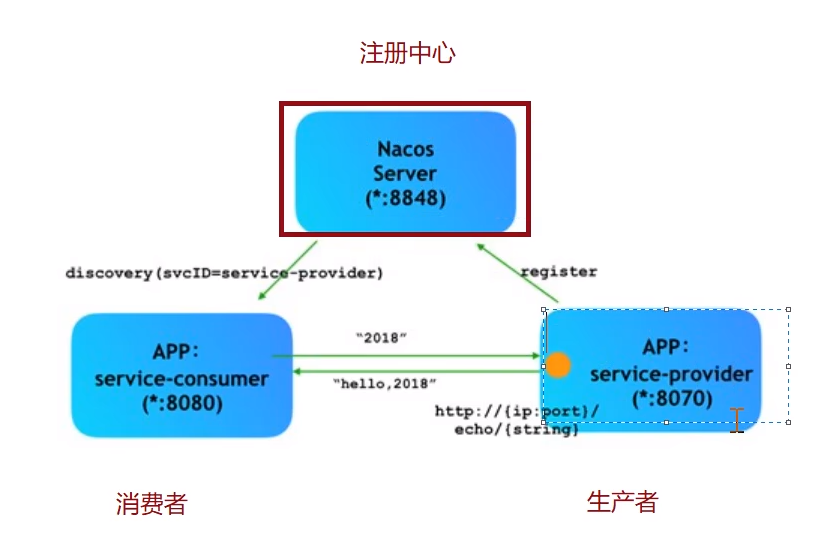
注册中心——生产者注册，登记端口号等信息。

使用：依赖-配置application-加注解@EnableDiscoveryClient

### gateway

## ElasticSearch

Elasticsearch (简称ES)是一个分布式、高扩展、高实时的、RESTful 风格的**搜索与数据分析**引擎。

Elasticsearch索引的精髓：一切设计都是为了提高搜索的性能。

面向文档数据库
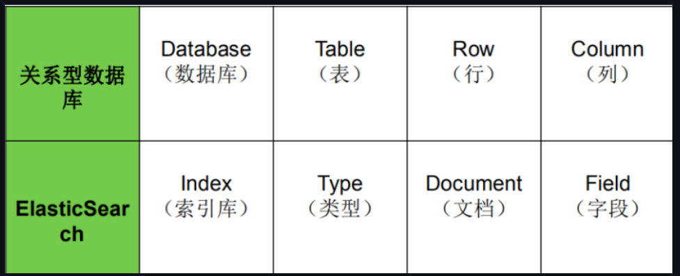

## MQ

异步处理

## 商品上下架

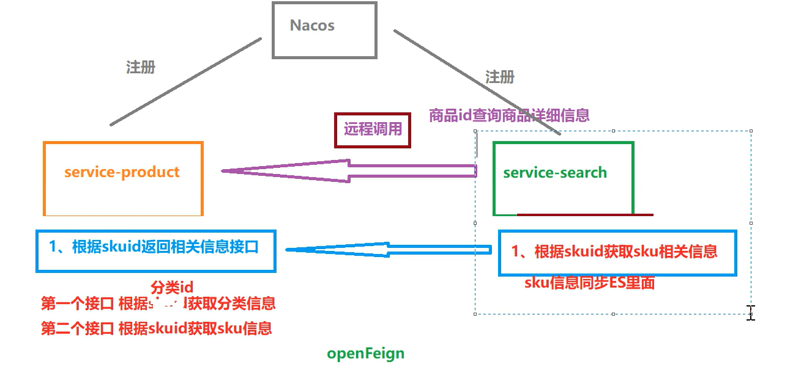

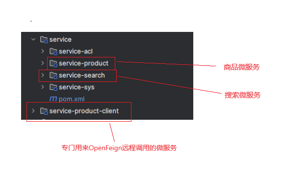

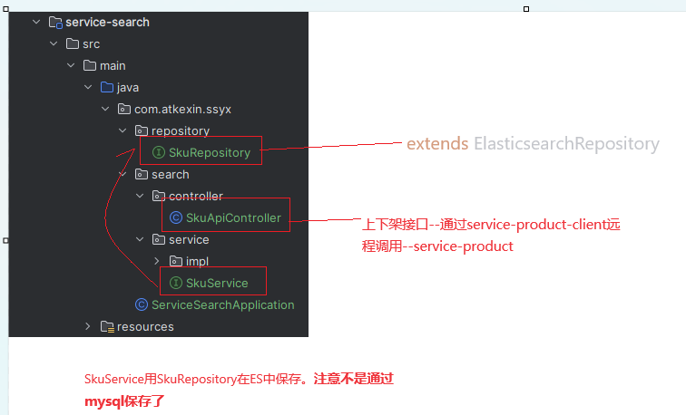

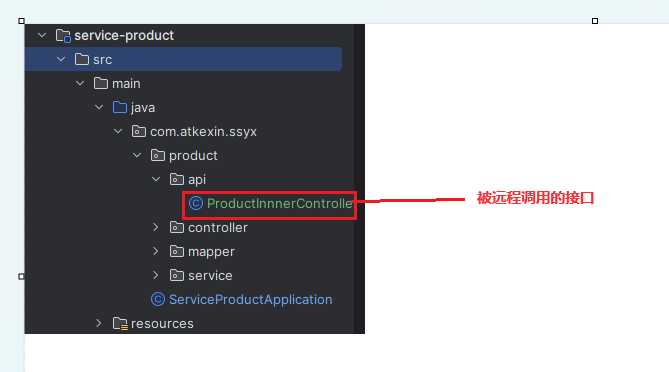

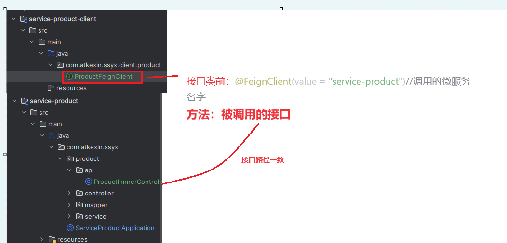

## MQ异步消息处理

###### 依赖

###### yaml配置

###### rabbit-utils

###### 生产消息的服务service-product

在sevice中，要发送消息的时候调用RabbitMQTemple的sendMessege（）方法。

###### 消费者消息的服务 service-search

在SkuReceiver中写接受消息，返回确认的方法。在方法中调用Service中上下架的方法。

### 注解

@Repository是Spring框架中的注解，用于标注数据访问层（DAO）的类。它的作用是将数据访问层的类标识为Spring容器中的Bean对象，从而可以在其他地方方便地使用。

## 商品SKU管理

SKU通俗来讲就是一个产品最小的出库单位。

## 报错

### If you want an embedded database (H2, HSQL or Derby), please put it on the classpath.

###### If you have database settings to be loaded from a particular profile you may need to activate it (no profiles are currently active).

将yml文件换成application.properties文件才能激活。

###### mybatis plus报Invalid bound statement (not found)

参考 https://blog.csdn.net/wwrzyy/article/details/86034458 保留一个配置就可以了，这俩配置冲突。

MySQL JDBC Error: Public Key Retrieval is not allowed

参考 https://www.codejava.net/java-se/jdbc/fix-error-public-key-retrieval-is-not-allowed

###### jdbc:mysql://localhost:3306/xxx?allowPublicKeyRetrieval=true&useSSL=false

Nginx配置错误：connect() failed (10061: No connection could be made because the target machine actively refused it) while connecting to upstream

微服务要同时启动！！！

###### requset url 有数据,前端没有

要在Controller上配置跨域

4个服务顺序启动

###### springCould整合feign提示required a bean of type xxx that could not be found

在确认所有注解正确的情况下：就是pom出了问题。但是要注意提示的后半句，或者完整的怕报错提示：Lookup method resolution failed;.cloud.openfeign.FeignClientFactoryBean] from ClassLoader

根据[SpringBoot运行出现 Lookup method resolution failed； nested exception is java.lang.IllegalStateException\_lookup method resolution failed; nested exception -CSDN博客](https://blog.csdn.net/jcmj123456/article/details/117190908)

解决方案是：

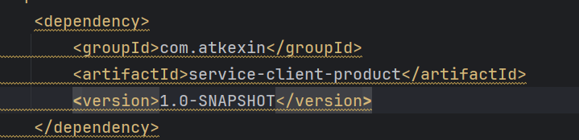

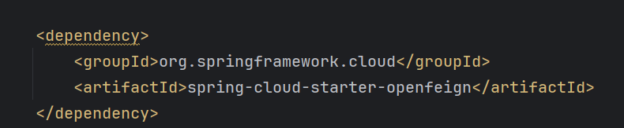

这两个依赖都不要《scpoe》标签

###### 返回200，依旧不显示画面

去掉controller上的@crossorigin

## 架构

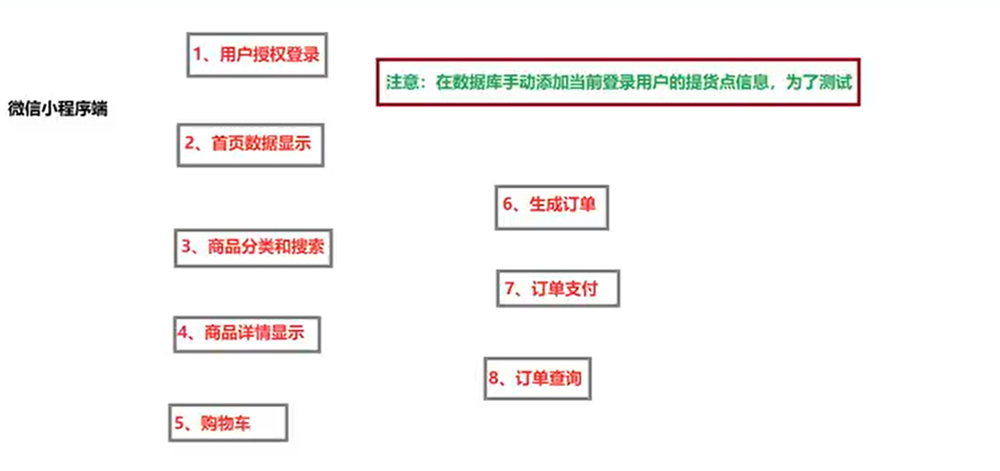

#### 控制层

sprig MVC（get、post、传参、取参的注释）、Swager
