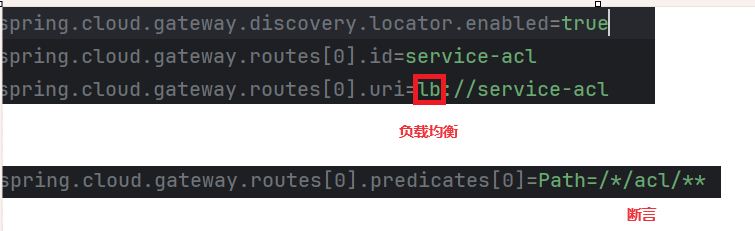
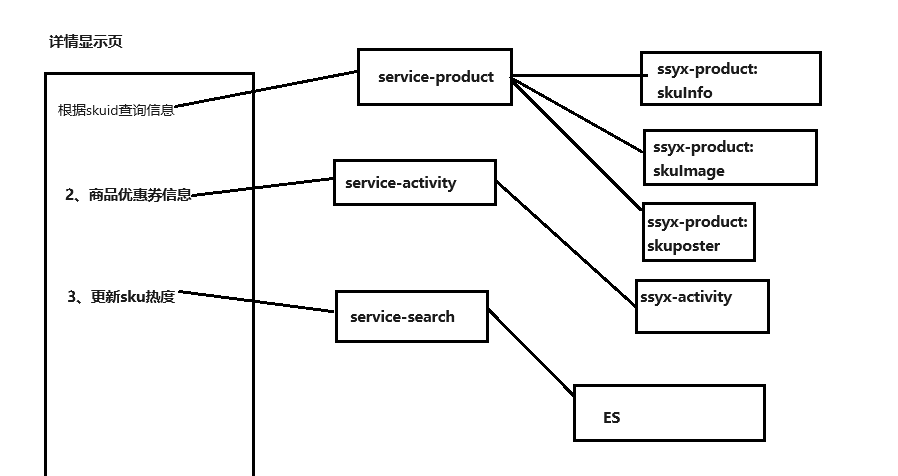
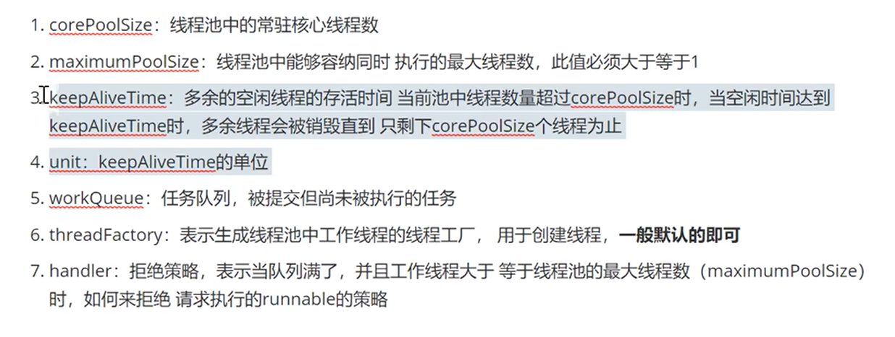
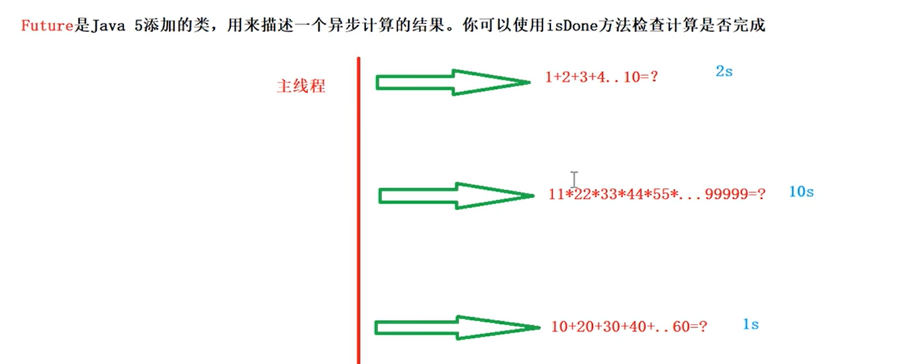
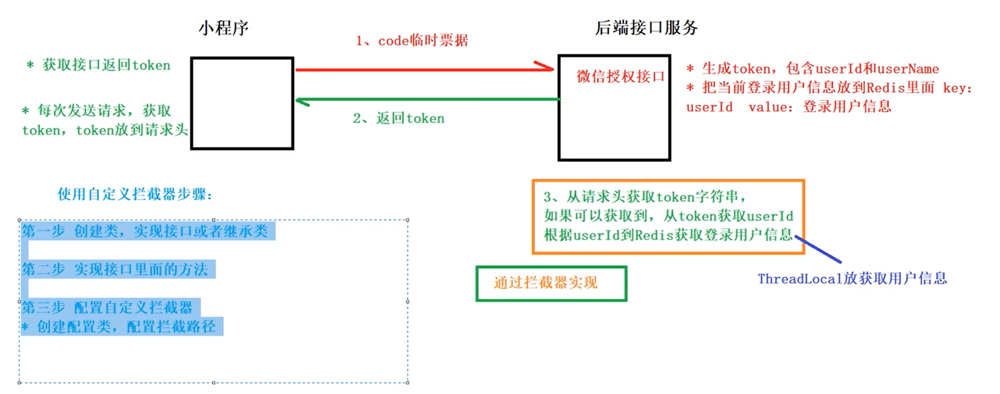
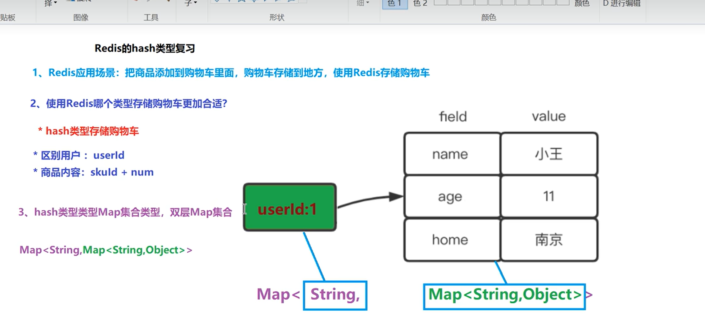

# 开发笔记

## lombok

作用：提高开发效率，通过注解形式使javabean生成get、set、有参数、无参数、toString等方法，无需手动实现。

## Mybatis

数据库管理简化开发工具。sql和java编码分开，功能边界清晰，一个专注业务，一个专注数据

### 使用

#### 1搭建数据库

#### 2新建项目——添加依赖

#### 3配置Mybatis——xml文件

#### 4编写Mybatis工具类

#### 5实体类

#### 6Dao接口

就是Mapper.java,添加扫描到mapper

## Nginx

### 反向代理服务器：转发请求到不同的微服务模块端口。


- 使用
  - 改配置
  - 端口号
  - 路径

开始 nginx.exe

结束 nginx.exe -s -stop

### 负载均衡：

* 流量分发：负载均衡器接收到来自客户端的请求后，根据负载均衡算法（如轮询、加权轮询、最少连接、哈希、优先级等）将请求分发到多个服务器上。
* 健康检查：负载均衡器还负责监控后端服务器的健康状态，确保将请求分发到可用的服务器上

## 阿里云OSS

在上传图片的模块中，通过阿里云OSS对图片文件存储。
阿里云对象存储 OSS（Object Storage Service）是一款海量、安全、低成本、高可靠的云存储服务，提供最高可达 99.995 % 的服务可用性。多种存储类型供选择，全面优化存储成本。
记得先写pom.xml依赖文件。

## SpringBoot

### 代码生成器

1依赖

**2工具类**
改：绝对路径+数据库+包名+表名

### 手动抛出异常

threw new 异常类。

## Spring

MultipartFile//一种类型得到上传的文件
@Value{}//从配置文件中取值

## Spring Cloud

Spring Cloud是一系列框架的集合。


### Nacos


注册中心——生产者注册，登记端口号等信息。

**1.服务注册**：Nacos Client会通过发送REST请求的方式向Nacos Server注册自己的服务，提供自身的元数据，比如ip地址、端口等信息。 Nacos Server接收到注册请求后，就会把这些元数据信息存储在一个双层的内存Map中。
**2.服务心跳**：在服务注册后，Nacos Client会维护一个定时心跳来持续通知Nacos Server，说明服务一直处于可用状态，防止被剔除。默认 5s发送一次心跳。
**3.服务同步**：Nacos Server集群之间会互相同步服务实例，用来保证服务信息的一致性。
**4.服务发现**：服务消费者（Nacos Client）在调用服务提供者的服务时，会发送一个REST请求给Nacos Server，获取上面注册的服务清 单，并且缓存在Nacos Client本地，同时会在Nacos Client本地开启一个定时任务定时拉取服务端最新的注册表信息更新到本地缓存
**5.服务健康检查**：Nacos Server会开启一个定时任务用来检查注册服务实例的健康情况，对于超过15s没有收到客户端心跳的实例会将它的 healthy属性置为false(客户端服务发现时不会发现)，如果某个实例超过30秒没有收到心跳，直接剔除该实例(被剔除的实例如果恢复发送 心跳则会重新注册)

**使用**：依赖-配置application-加注解@EnableDiscoveryClient

### gateway



## ElasticSearch

Elasticsearch (简称ES)是一个分布式、高扩展、高实时的、**RESTful** 风格的**搜索与数据分析**引擎。

Elasticsearch索引的精髓：一切设计都是为了提高搜索的性能。

面向文档数据库


## 商品上下架


## MQ异步消息处理

- 依赖
- yaml配置
- rabbit-utils


- 生产消息的服务service-product
  - 在sevice中，要发送消息的时候调用RabbitMQTemple的sendMessege（）方法。
- 消费者消息的服务 service-search
  - 在SkuReceiver中写接受消息，返回确认的方法。在方法中调用Service中上下架的方法。

### 注解

@Repository是Spring框架中的注解，用于标注数据访问层（DAO）的类。它的作用是将数据访问层的类标识为Spring容器中的Bean对象，从而可以在其他地方方便地使用。

## 用户登录

### token

唯一标识，对标识编码、加密。

登录状态+

#### JWT

生成token工具：对标识编码、加密

公有

私有

签名

### 详情显示——多线程





异步编程：completablefuture继承了future

+ 创建异步对象
  + runAsync方法不支持返回值
  + supplyAsync可以支持返回值
+ 计算完成时回调方法
  + whenComplete：是执行当前任务的线程执行继续执行 whenComplete 的任务。
  + whenCompleteAsync：是执行把 whenCompleteAsync 这个任务继续提交给线程池来进行执行。
+ 串行化执行
  + thenRun方法：只要上面的任务执行完成，就开始执行thenRun，只是处理完任务后，执行 thenRun的后续操作
+ 多任务组合
  + allOf：等待所有任务完成
  + anyOf：只要有一个任务完成

### 登录拦截器

换个名字，获取登录用户的信息



## 购物车



## 报错

### If you want an embedded database (H2, HSQL or Derby), please put it on the classpath.


### If you have database settings to be loaded from a particular profile you may need to activate it (no profiles are currently active).

将yml文件换成application.properties文件才能激活。

### mybatis plus报Invalid bound statement (not found)

参考 https://blog.csdn.net/wwrzyy/article/details/86034458 保留一个配置就可以了，这俩配置冲突。

MySQL JDBC Error: Public Key Retrieval is not allowed

参考 https://www.codejava.net/java-se/jdbc/fix-error-public-key-retrieval-is-not-allowed

### jdbc:mysql://localhost:3306/xxx?allowPublicKeyRetrieval=true&useSSL=false

Nginx配置错误：connect() failed (10061: No connection could be made because the target machine actively refused it) while connecting to upstream

微服务要同时启动！！！

### requset url 有数据,前端没有

要在Controller上配置跨域

4个服务顺序启动

### springCould整合feign提示required a bean of type xxx that could not be found

在确认所有注解正确的情况下：就是pom出了问题。但是要注意提示的后半句，或者完整的怕报错提示：Lookup method resolution failed;.cloud.openfeign.FeignClientFactoryBean] from ClassLoader

根据[SpringBoot运行出现 Lookup method resolution failed； nested exception is java.lang.IllegalStateException\_lookup method resolution failed; nested exception -CSDN博客](https://blog.csdn.net/jcmj123456/article/details/117190908)

解决方案是：


这两个依赖都不要《scpoe》标签

### 返回200，依旧不显示画面

去掉controller上的@crossorigin，是controller，不是启动类

### Cause: java.sql.SQLException: Incorrect integer value: 'USER' for column 'user_type' at row 1

服了，去掉了枚举，UserType用了int

### Exception encountered during context initialization - cancelling refresh attempt: org.springframework.beans.factory.BeanCreationException: Error creating bean with name 'categoryApiController': Injection of resource dependencies failed; nested exception is org.springframework.beans.factory.BeanCreationException: Error creating bean with name 'com.atkexin.ssyx.product.client.ProductFeignClient': FactoryBean threw exception on object creation; nested exception is org.springframework.beans.factory.UnsatisfiedDependencyException: Error creating bean with name 'mybatisPlusConfig': Unsatisfied dependency expressed through field 'dataSource'; nested exception is org.springframework.beans.factory.NoSuchBeanDefinitionException: No qualifying bean of type 'javax.sql.DataSource' available: expected at least 1 bean which qualifies as autowire candidate. Dependency annotations:

报错提示

```
***************************
APPLICATION FAILED TO START
***************************

Description:

Field dataSource in com.atkexin.ssyx.common.config.MybatisPlusConfig required a bean of type 'javax.sql.DataSource' that could not be found.

The injection point has the following annotations:
	- @org.springframework.beans.factory.annotation.Autowired(required=true)

The following candidates were found but could not be injected:
	- Bean method 'dataSource' in 'JndiDataSourceAutoConfiguration' not loaded because @ConditionalOnProperty (spring.datasource.jndi-name) did not find property 'jndi-name'
	- Bean method 'dataSource' in 'XADataSourceAutoConfiguration' not loaded because @ConditionalOnClass did not find required class 'javax.transaction.TransactionManager'```

```

mybatispuls配置类有误，重新赋值了一遍

## 架构


#### 控制层

sprig MVC（get、post、传参、取参的注释）、Swager
